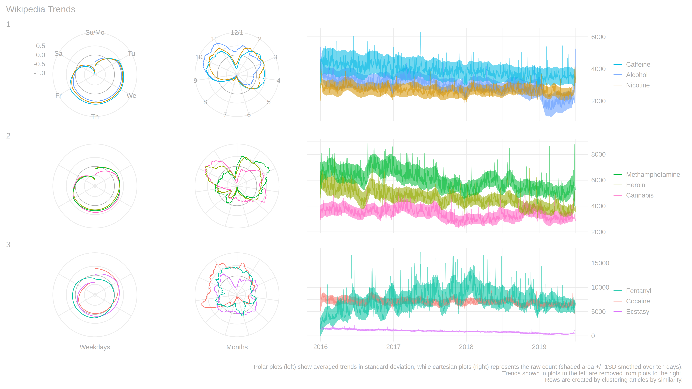

<!-- README.md is generated from README.Rmd. Please edit that file -->

# Wiki Trends

<!-- badges: start -->

<!-- badges: end -->

You find [over here](https://aaronpeikert.github.io/wiki-trends/) the
endproduct of a seminar on data visualization, showing views per day of
a set of wikipedia articles.

``` r
articles <- c(
  "Alcohol",
  "Nicotine",
  "Caffeine",
  "Cannabis",
  "Methamphetamine",
  "Cocaine",
  "Heroin",
  "Ecstasy",
  "Fentanyl"
)
get_articles(articles, ymd("2015-01-01"), ymd("2019-12-31")) %>%
  remove_outliers() %>%
  extract_trend() %>%
  add_dates() %>%
  extract_wday_trend() %>%
  extract_year_trend() %>%
  remove_pattern() %>%
  add_cluster(nclust = 3) %>%
  plot_final()
```

<!-- -->

[ This work is
licensed under a Creative Commons Attribution 2.0 Generic
License.](http://creativecommons.org/licenses/by/2.0/)
